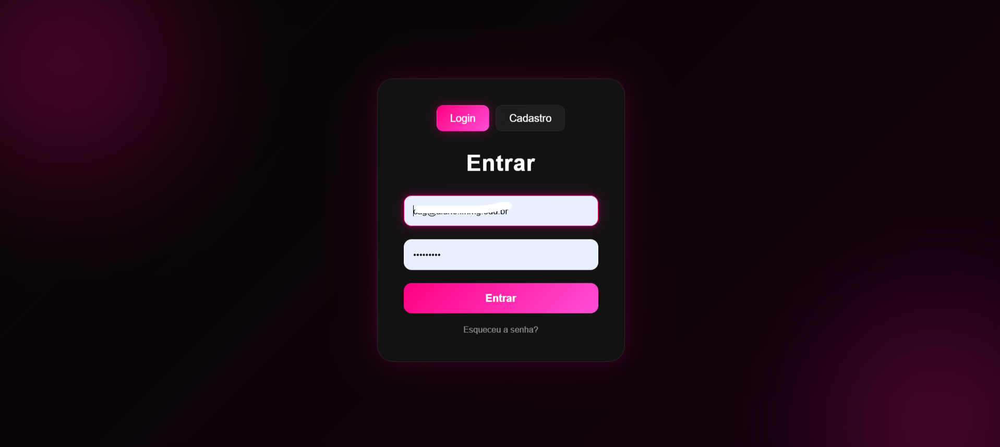

# 🔐 Sistema de Login - Laravel

Sistema de autenticação desenvolvido com **Laravel**, focado em boas práticas de desenvolvimento web, segurança e uma interface moderna e responsiva.

---

## 📸 Preview

<p align="center">
  
</p>


---

## 🚀 Tecnologias Utilizadas

Este projeto foi construído com as seguintes tecnologias:

- **[Laravel](https://laravel.com/ )** - Framework PHP para artesãos da web.
- **[Blade](https://laravel.com/docs/blade )** - Engine de templates poderosa do Laravel.
- **[Tailwind CSS](https://tailwindcss.com/ )** - Framework CSS utilitário para design rápido.
- **[MySQL](https://www.mysql.com/ )** - Banco de dados relacional.
- **[JavaScript](https://developer.mozilla.org/pt-BR/docs/Web/JavaScript )** - Para interatividade no front-end.

---

## ✨ Funcionalidades

- [x] Autenticação segura (Login e Registro).
- [x] Recuperação de senha por e-mail.
- [x] Verificação de e-mail.
- [x] Perfil do usuário (Edição de dados e senha).
- [x] Interface Dark Mode personalizada com tons Neon.
- [x] Proteção contra ataques CSRF e SQL Injection.

---

## 🛠️ Como rodar o projeto

1. **Clone o repositório:**
   ```bash
   git clone https://github.com/GuedesC2/sistema-login.git
